# Informe del Laboratorio 3 - Transporte

## Integrantes:

* Renzo Condormango
* Simón Celoria
* Francisco Porcel de Peralta

## Introducción:
En este laboratorio tuvimos que simular como se comportaba una red en base a diferentes escenarios. Primero empezamos con 
una red simple que solo intentaba pasar paquetes de un punto a otro sin tener en cuenta que se podía producir un cuello de 
botella. En base a los dos casos que nos dieron y los datarate que tenían las distintas conexiones, el cuello de botella se
podía producir en un punto u otro. Finalmente tuvimos que desarrollar más nuestra red para poder solucionar estos problemas
de **_control de flujo_** y **_control de congestión_**

## Herramientas:
Para la realización de este laboratorio utilizamos el software de OMNNET++ para poder simular las redes. 

Usamos C++ para la codificación de los distintos componentes de una red y Python junto con Jupyter Notebook para la 
visualización de los distintos gráficos de los escenarios.

# Red simple:
La red simple está conformada por un **nodo transmisor** `nodeTx`, un **nodo receptor** `nodeRx` y un nodo intermedio que
conecta los dos nodos anteriores simulando una subred.

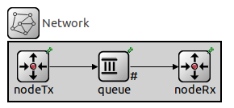

### Esta red esta desarrollada de la siguiente manera:
* El `nodeTx` genera paquetes de 12500 bytes, estos son generados cada cierto intervalo con media de **0.01s** y distribución exponencial.
* Además tiene un **buffer** de datos que almacena un total de 200 mil paquetes, ya que genera paquetes a una velocidad muy alta tiene que tener un lugar donde guardar estos paquetes.

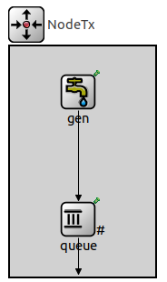

* El network tiene un queue que conecta `nodeTx` con `nodeRx`, este simula una subred y tiene una capacidad de 200 paquetes como máximo

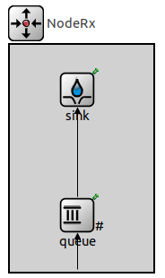

* El `nodeRx` tiene un buffer de almacenamiento de 200 paquetes, el cual se conecta con un "sink" el cual simula el lugar a donde tienen que llegar los paquetes finalmente.

* Las conexiones entre los distintos nodos cuentan con un delay de propagación de los paquetes entre notos, y un datarate máximo soportado por esa conexión. Estos parámetros los podemos cambiar a nuestro criterio, los que vamos a usar serán los dados por el caso 1 y 2 del enunciado del laboratorio.

## Caso 1 de estudio:

| Parametros    | nodeTx -> Queue |Queue -> nodeRx|nodeRx -> Queue (nodeRx)|Queue (nodeRx) -> Sink|
| ------------- | :-------------: |:-------------:|:----------------------:|:--------------------:|
| delay         |     100 us      |     100 us    | -                      | -                    |
| Datarate      |     1 Mbps      |     1 Mbps    | -                      | 0.5 Mbps             |

### Hipótesis:

En este caso podemos ver que el delay y el datarate para la "ruta" desde nodeTx a nodeRx son todos iguales.

Sin embargo como la conexión que une el Queue interno de nodeRx con el Sink tiene un datarate igual a la mitad del datarate
que tenian las otras conexiones, podemos intuir que se puede dar un cuello de botella en ese buffer, incluso podríamos ir
más allá y decir que cada dos paquetes generados se va a entregar uno, por ende llegará un punto en el cual el buffer del 
nodeRx llegue a su capacidad máxima de 200 paquetes y empiece a generar pérdida de paquetes, ya que no podrá almacenar más
(esto se conoce como problema de **control de flujo**).

Sabiendo que cada 2 paquetes entrega 1, podemos incluso intuir que para cuando hayan salido 400 paquetes de nodeTx va a ser
cuando se dará el problema descrito.

### Mediciones:

Realizamos distintas mediciones de este caso con distintos interavalos de generación de paquetes, analizando así puntos críticos como en los que ya no se pierden paquetes (lo cual se daría cuando el intervalo de generación de paquetes es muy grande).

| Intv | Gen   | Recv   | Qdrop   | Sdrop   | Delay   |
|----|----|----|----|----|----|
| 0.1 | 1979 | 998 | 0 | 770 | 32 |
| 0.14 | 1418 | 998 | 0 | 206 | 26 |
| 0.15 | 1307 | 998 | 0 | 108 | 23 |
| 0.16 | 1238 | 997 | 0 | 40 | 19 |
| 0.17 | 1162 | 997 | 0 | 0 | 14 |
| 0.18 | 1104 | 994 | 0 | 0 | 10 |
| 0.2 | 989 | 976 | 0 | 0 | 8 |
| 0.5 | 390 | 389 | 0 | 0 | 0.4 |
| 0.8 | 241 | 241 | 0 | 0 | 0.4 |
| 2 | 99 | 99 | 0 | 0 | 0.4 |

Donde:
* Intv: Intervalo de generacion.
* Gen: Generacion de paquetes.
* Recv: Paquetes recibidos.
* Qdrop: Paquetes dropeados en Queue
* Sdrop: Paquetes dropeados en Sink

Aca podemos ver una importante perdida de paquetes (en el nodo intermedio del sink) en intervalos de generacion más pequeños.
A partir del intervalo 1.6 ya se evita el colapsamiento del buffer intermedio. 

### En la siguiente imagen vemos la ocupacion de los distintos bufferes a lo largo del tiempo de simulacion:

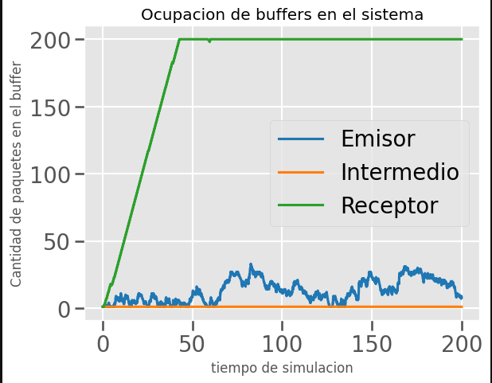

Se destaca particularmente que el buffer del receptor colapsa al poco tiempo de la simulacion y el buffer intermedio no tiene ocupacion.

### Podemos observar la perdida de paquetes a lo largo del tiempo:

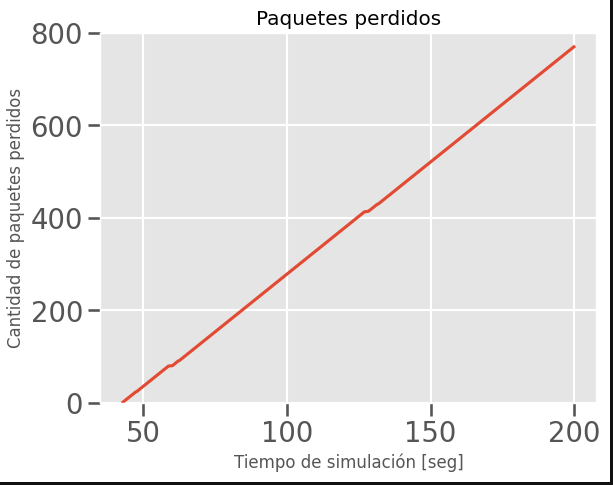

### Observamos el retraso en el envio de los paquetes:
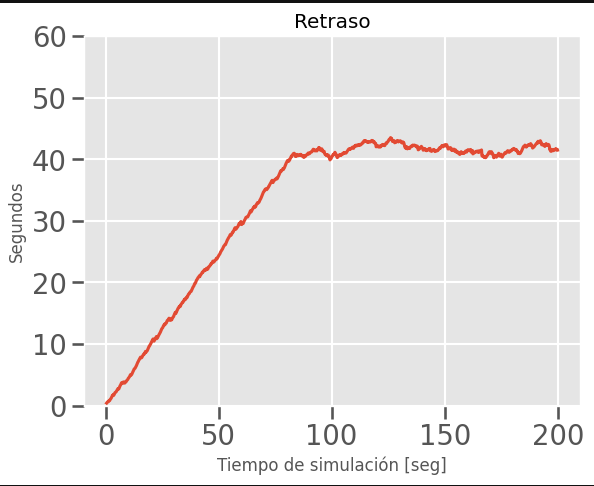

*Importante observar esta grafica y ver que el retraso maximo no excede los 40/45 seg, ya que al implementar nuestro algoritmo lo mas importante es el costo en terminos de tiempo para evitar la perdida de paquetes.* 

### Paquetes enviados, recibidos y perdidos/en la red
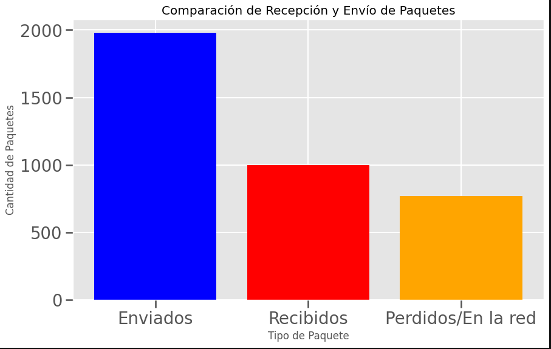

## Caso 2 de estudio:

| Parametros    | nodeTx -> Queue |Queue -> nodeRx|nodeRx -> Queue (nodeRx)|Queue (nodeRx) -> Sink|
| ------------- | :-------------: |:-------------:|:----------------------:|:--------------------:|
| delay         |     100 us      |     100 us    | -                      | -                    |
| Datarate      |     1 Mbps      |     0.5 Mbps  | -                      | 1 Mbps               |

### Hipótesis:

En este caso podemos ver que la conexión que une el nodeTx con el Queue del network (el que simula una subred) tiene un dataRate de 1Mbps
pero la conexión que une el Queue del network con el nodeRx tiene un datarate de 0.5Mbps lo cual nos indica que se dará
un cuello de botella en ese punto, en el Queue del netwokr.

Similar al caso anterior, cada dos paquetes se entregará uno solo, lo cual a la larga hará que el buffer del Queue se llene
y por ende empiece a haber pérdida de paquetes.

Dado que la cantidad de paquetes que se pueden enviar está limitado por la red, más específicamente la subred, y es esta
la razón de la pérdida de datos, estamos frente a un problema de **control de congestión**

### Mediciones:
Similar al caso anterior pero veremos que la congestion esta ocasionada en el nodo intermedio (Queue) por lo que la perdida de paquetes ocurre en un lugar distinto.

| Intv | Gen   | Recv   | Qdrop   | Sdrop   | Delay   |
|----|----|----|----|----|----|
| 0.1 | 1979 | 998 | 770 | 0 | 32 |
| 0.14 | 1418 | 998 | 206 | 0 | 26 |
| 0.15 | 1307 | 998 | 108 | 0 | 23 |
| 0.16 | 1238 | 997 | 40 | 0 | 19 |
| 0.17 | 1162 | 997 | 0 | 0 | 14 |
| 0.18 | 1104 | 994 | 0 | 0 | 10 |
| 0.2 | 989 | 976 | 0 | 0 | 8 |
| 0.5 | 390 | 389 | 0 | 0 | 0.4 |
| 0.8 | 241 | 241 | 0 | 0 | 0.4 |
| 2 | 99 | 99 | 0 | 0 | 0.4 |

Donde:
* Intv: Intervalo de generacion.
* Gen: Generacion de paquetes.
* Recv: Paquetes recibidos.
* Qdrop: Paquetes dropeados en Queue
* Sdrop: Paquetes dropeados en Sink

Aca podemos ver una importante perdida de paquetes (en el nodo de la cola) en intervalos de generacion más pequeños.
A partir del intervalo 1.6 ya se evita el colapsamiento del buffer intermedio. 

### En la siguiente imagen vemos la ocupacion de los distintos bufferes a lo largo del tiempo de simulacion:

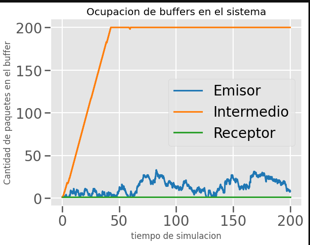

Se destaca particularmente que el buffer del nodo intermedio colapsa al poco tiempo de la simulacion y el buffer del receptor no tiene ocupacion, lo que demuestra un comportamiento igual en cuanto a la congestion pero dandose en un lugar distinto.

### Podemos observar la perdida de paquetes a lo largo del tiempo:

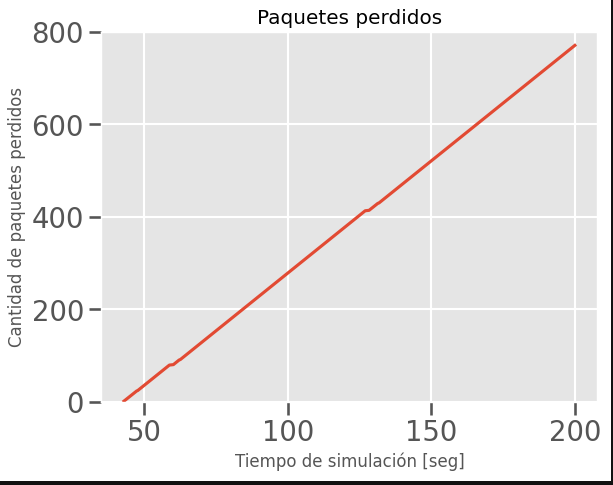

### Observamos el retraso en el envio de los paquetes:
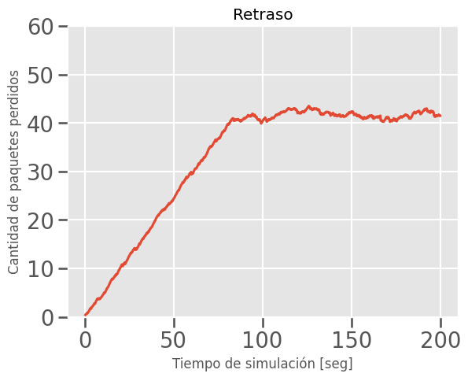

*Se vuelve a observar un retraso similar al primer caso* 

### Paquetes enviados, recibidos y perdidos/en la red

Denuevo observamos una perdida de paquetes importantes (practicamente la mitad).

## Conclusión de la primera parte:
¿Qué diferencia observa entre el caso de estudio I y II? ¿Cuál es la fuente limitante en cada uno?

Comparando los dos casos podemos ver lo siguiente:

* El cuello de botella sigue existiendo de manera similar, ambas redes tienen la misma carga útil máxima, lo que cambia es el lugar donde ocurre el cuello de botella.
* El caso I es un problema de flujo mientras que el caso II es un problema de congestión. Por la diferencia de tamaño de buffer (la subred tiene menos buffer que el receptor) el colapso del caso II ocurre ligeramente antes.
* La fuente limitante en cada caso es la diferencia de datarate en las conexiones.

# Red desarrollada:
Esta red sería nuestra propuesta para solucionar el problema de control de flujo y control de congestión que vimos en el
apartado anterior.

Está conformada por un **nodo transmisor** `nodeTx`, un **nodo receptor** `nodeRx` y 2 nods intermedios que
conectan `nodeTx` con `nodeRx`, uno lo usaremos como subred y otro como un canal de comunicación entre estos nodos para que
puedan transmitir datos extra acerca del estado en el que se encuentran.

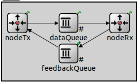

### Esta red implementa el siguien algoritmo:

Al inicio, desde `nodeTx`, sale un `FeedbackPkt` el cual es enviado al `DataQueue` donde le pregunta cual es su capacidad **total** para
recibir paquetes, luego este paquete es añadido a la cola y espera a ser enviado al `nodeRx` donde preguntara por su capacidad **restante**
y comparara dicha capacidad con la del `DataQueue` para ver cual es la menor. 

El paquete de control vuelve al `nodeTx` a travez del `FeedbackQueue` donde informa la capacidad de que obtuvo para que el emisor pueda 
enviar esa cantidad de paquetes, por lo cual no se perderan paquetes, pues se sabe de antemano cuantos se pueden recibir en cada lugar.
Una vez enviados esos los `DataPkt` se procede a enviar nuevamente `FeedbackPkt` para repetir el proceso. 
Este ultimo paquete esta incluido en la cantidad de paquetes a enviar para que asi nunca se pueda **"dropear"** el paquete de control.

## Caso 1 de estudio:

| Parametros    | nodeTx -> Queue |Queue -> nodeRx|nodeRx -> Queue (nodeRx)|Queue (nodeRx) -> Sink|
| ------------- | :-------------: |:-------------:|:----------------------:|:--------------------:|
| delay         |     100 us      |     100 us    | -                      | -                    |
| Datarate      |     1 Mbps      |     1 Mbps    | -                      | 0.5 Mbps             |

### Hipótesis:

Gracias a que nuestro algoritmo pregunta al Buffer que esta dentro de `nodeRx` cuantos paquetes puede recibir, nunca deberian llegar
en mayor cantidad, por lo que deberia impedirse **por completo** la perdida de paqutes en este punto que era el cuello de botella del primer caso.
Esto manteniendo buenos resultados en la comparacion entre **Carga Util vs Carga Ofrecida**. Sin embargo esto deberia ocasionar un mayor `Delay`.

### Mediciones:

Realizamos las mismas mediciones que en ambos casos de la primera parte, y observamos que no se genera perdida de paquetes en ningun vector que registraba la perdida.

| Intv | Gen   | Recv   | Qdrop   | Sdrop   | Delay   |
|----|----|----|----|----|----|
| 0.1 | 1979 | 998 | 0 | 0 | 49 |
| 0.14 | 1418 | 998 | 0 | 0 | 29 |
| 0.15 | 1307 | 998 | 0 | 0 | 24 |
| 0.16 | 1238 | 997 | 0 | 0 | 19 |
| 0.17 | 1162 | 997 | 0 | 0 | 14 |
| 0.18 | 1104 | 994 | 0 | 0 | 10 |
| 0.2 | 989 | 976 | 0 | 0 | 2 |
| 0.5 | 390 | 389 | 0 | 0 | 0.45 |
| 0.8 | 241 | 241 | 0 | 0 | 0.42 |
| 2 | 99 | 99 | 0 | 0 | 0.4 |

Donde:
* Intv: Intervalo de generacion.
* Gen: Generacion de paquetes.
* Recv: Paquetes recibidos.
* Qdrop: Paquetes dropeados en Queue
* Sdrop: Paquetes dropeados en Sink

Lo que si se puede observar es un incremento en el tiempo de envio de paquetes de +10 seg en los intervalos en donde se generaba la perdida de paquete en los casos anteriores.

### Observamos la ocupacion de los bufferes

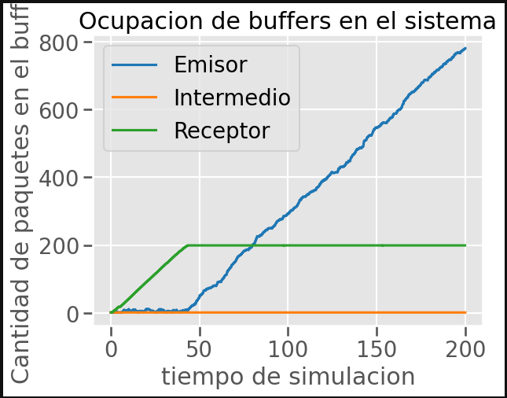

*En este gráfico podemos ver que el buffer del `nodeRx` se mantiene
lleno en 200 a partir del segundo 40. Este comportamiento se debe a
que el datarate de la conexión que una el Queue del nodo receptor 
con el sink, es la mitad a comparación del datarate de las otras
conexiones, por ende se podría decir que cada 2 paquetes se envía 1.
Por como funciona nuestro algoritmo en la primera vuelta se informa
que se pueden enviar 200 paquetes, para cuando se envían los 200
paquetes se habrán entregado 100, luego en la siguiente vuelta se 
informa de una ventana de 100 paquetes, para cuando se envían los 
100 paquetes se habrán entregado 50, ahora tengemos 150 paquetes en 
buffer y nuestra ventana es de 50... y así sucesivamente hasta que 
nos quedamos con una ventana de 2 paquetes libres constantes para
cada vuelta, en la cual un espacio se utiliza para el feedBackPkt y
otro para el paquete de datos.*

### Delay

Aqui es donde esta el mayor problema de nuestro algoritmo y es el costo en terminos de tiempo de envio de paquetes, el cual aumento de forma importante

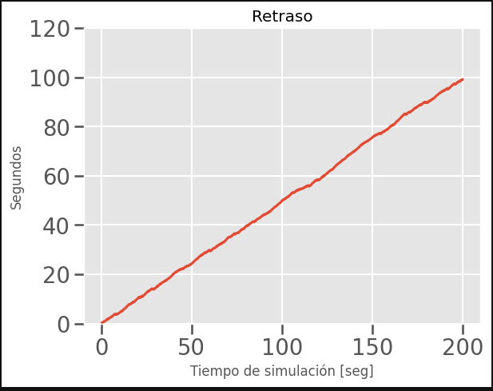

Pero como podemos observar en la siguiente grafica:

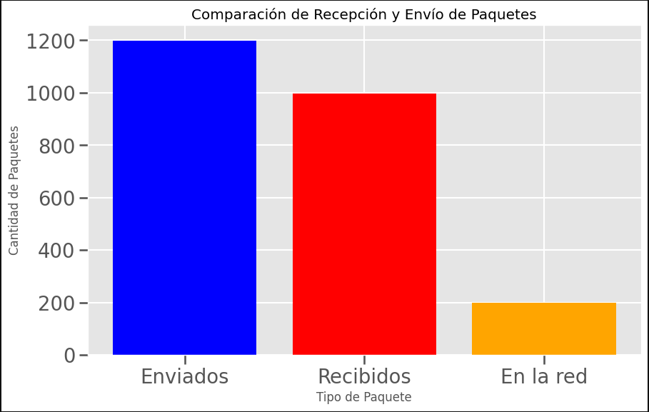

La perdida de paquetes desaparece y los unicos paquetes que no quedan registrados (de los enviados por el emisor) en el receptor son los que quedan en la red a la hora de terminar la simulacion.

Se puede observar particularmente que no hay perdida de paquetes al quedar en 0 los vectores que registran estas perdidas en los disintos puntos anteriormente nombrados donde existio tal perida.

## Caso 2 de estudio:

| Parametros    | nodeTx -> Queue |Queue -> nodeRx|nodeRx -> Queue (nodeRx)|Queue (nodeRx) -> Sink|
| ------------- | :-------------: |:-------------:|:----------------------:|:--------------------:|
| delay         |     100 us      |     100 us    | -                      | -                    |
| Datarate      |     1 Mbps      |     0.5 Mbps  | -                      | 1 Mbps               |

### Hipótesis:

Debido a que nuestro algoritmo pregunta al Buffer que esta dentro de `DataQueue` cuantos paquetes puede recibir, nunca deberian llegar
en mayor cantidad, por lo que deberia impedirse **por completo** la perdida de paqutes en este punto que era el cuello de botella del segundo caso.
Esto manteniendo buenos resultados en la comparacion entre **Carga Util vs Carga Ofrecida**. Sin embargo esto deberia ocasionar un mayor `Delay`.

### Mediciones:

Realizamos mediciones extras para este caso en particular buscando algun comportamiento especial, pero no encontramos nada especial.

| Intv | Gen   | Recv   | Qdrop   | Sdrop   | Delay   |
|----|----|----|----|----|----|
| 2 | 99 | 99 | 0 | 0 | 0.4 |
| 0.8 | 241 | 241 | 0 | 0 | 0.4 |
| 0.5 | 390 | 389 | 0 | 0 | 0.4 |
| 0.4 | 493 | 493 | 0 | 0 | 1.10 |
| 0.3 | 659 | 655 | 0 | 0 | 0.57 |
| 0.24 | 840 | 831 | 0 | 0 | 0.83 |
| 0.23 | 874 | 871 | 0 | 0 | 1 |
| 0.22 | 902 | 901 | 0 | 0 | 1.24 |
| 0.2 | 989 | 976 | 0 | 0 | 2 |
| 0.18 | 1104 | 992 | 0 | 0 | 10 |
| 0.175 | 1129 | 994 | 0 | 0 | 12 |
| 0.17 | 1162 | 995 | 0 | 0 | 14 |
| 0.16 | 1238 | 995 | 0 | 0 | 19 |
| 0.15 | 1307 | 995 | 0 | 0 | 24 |
| 0.14 | 1418 | 995 | 0 | 0 | 29 |
| 0.1 | 1979 | 998 | 0 | 0 | 49 |
| 0.05 | 3914 | 996 | 0 | 0 | 74 |

Donde:
* Intv: Intervalo de generacion.
* Gen: Generacion de paquetes.
* Recv: Paquetes recibidos.
* Qdrop: Paquetes dropeados en Queue
* Sdrop: Paquetes dropeados en Sink

Denuevo se observa un incremento en los tiempos de envio de paquetes como era esperado dado nuestro algoritmo.

### Observamos la ocupacion de los bufferes

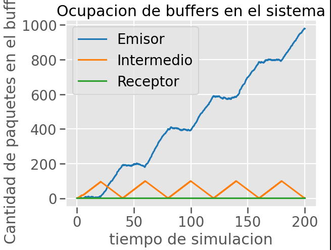

*En este caso vemos como el único buffer que se está llenando es el de la subred, esto se debe a que la conexión del `nodeTx` con este
Queue tiene un datarate de 0.5Mbps mientras que las demás tienen un
datarate de 1Mbps, esto significaría que cada 2 paquetes se entregaría
uno. Esto lo vemos en nuestra gráfica que en cada ciclo envía 200 paquetes llegando a capacidad de 100 como máximo en el Queue del medio, una vez llegado a este umbral, como tiene que esperar a que llegue el feedback indicando la nueva ventana, el tamaño del buffer
empieza a bajar hasta que se envía el feedBackPkt al `nodeRx` (como
este paquete es el ultimo que se envió, se envía cuando el buffer del
Queue queda en 0) y de ahí empieza a subir de nuevo el uso de nuestro 
buffer, dando así una gráfica similar a una sierra. Podemos ver también 
que el buffer del Receptor no se llena, y esto es porque a medida que 
le llegan los paquetes los entrega, ya que sus conexiones tienen el mismo datarate.* 

### Delay

Aqui es donde esta el mayor problema de nuestro algoritmo y es el costo en terminos de tiempo de envio de paquetes, el cual aumento de forma importante

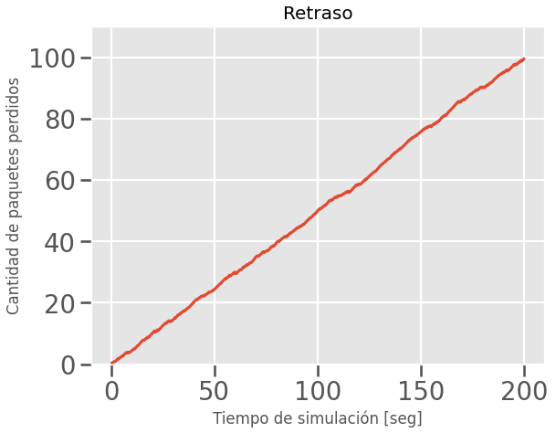

Pero como podemos observar en la siguiente grafica:

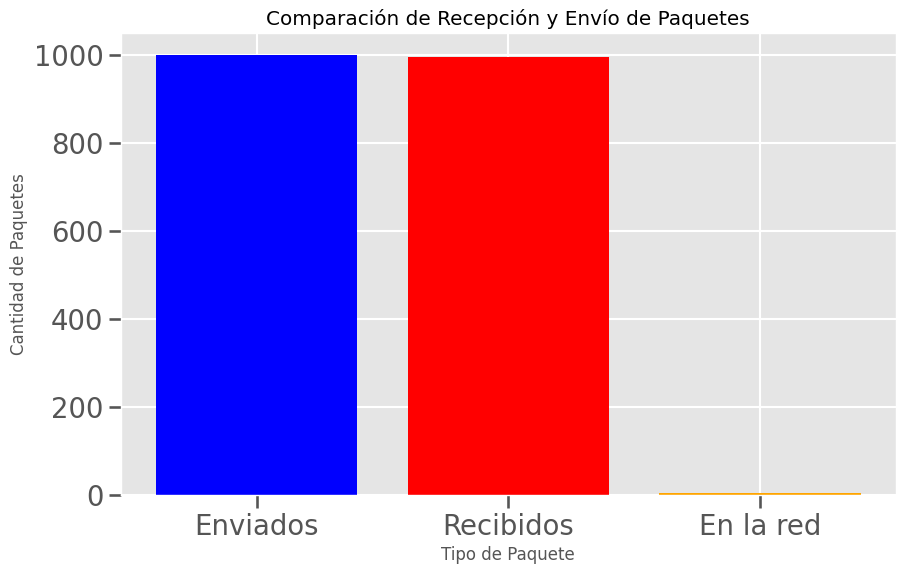

Denuevo ya no hay perdida de paquetes.

Particularmente que no hay perdida de paquetes al quedar en 0 los vectores que registran estas perdidas en los disintos puntos anteriormente nombrados donde existio tal perida.

## Conclusión:

Nuestro algoritmo presenta una forma de evitar totalmente la perdida de paquetes.
Hacemos un costo-beneficio alto al sacrificar tanto rendimiendo para no tener perdida de paquetes.
Ya no se que mas poner aca jijo

## Mejoras posibles del algoritmo

Menos se que poner aca kjjj se jijea el jijonazo

# Referencias:

- [1] Tanenbaum A. S. (2012). Redes de computadores (5ta ed.) Pearson.
- [2] Kurose, J. F. and Ross, K. W. Computer Networking - A Top Down Approach. 7th Edition, Pearson, 2017
- [3] OMNeT++ Simulation Manual: [Manual de omnet](https://doc.omnetpp.org/omnetpp/manual/)
- [4] ChatGPT (consultas simples de código)
